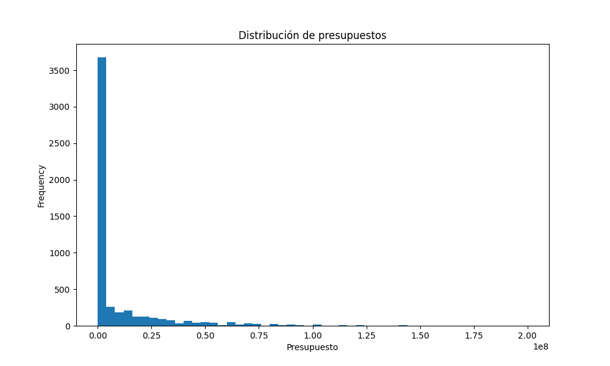
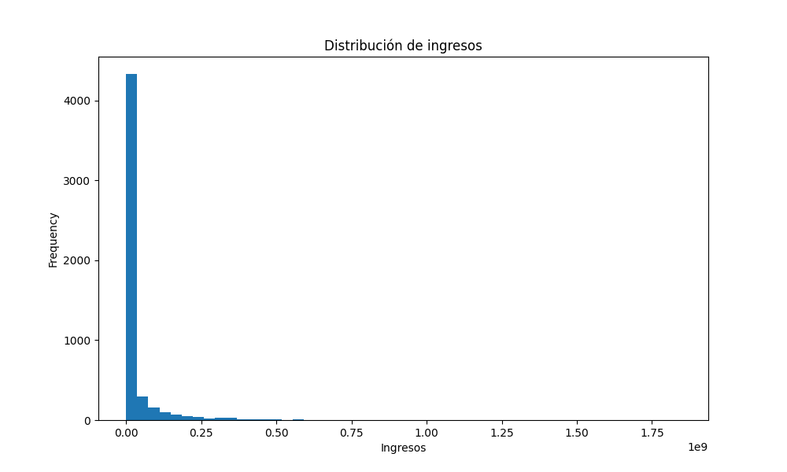

# Proyecto de Recomendación de Películas

## Descripción del Proyecto
Este proyecto consiste en la construcción de un sistema de recomendación de películas utilizando datos de plataformas de streaming. El enfoque incluye la transformación de datos, exploración de los mismos, desarrollo de una API para consultas, y el despliegue de un modelo de Machine Learning para realizar recomendaciones personalizadas.

---

## Análisis Exploratorio de Datos (EDA)

### Propósito
El objetivo del EDA es comprender las características y patrones presentes en los datos disponibles para tomar decisiones informadas durante las etapas posteriores del proyecto. El análisis se centró en los conjuntos de datos `credits` y `movies`.

### Resultados Clave

#### Distribución de Presupuestos
- Se identificó que la mayoría de las películas tienen presupuestos bajos (por debajo de $50 millones).
- Las producciones con presupuestos muy altos son excepciones, pero contribuyen significativamente a los ingresos globales.

#### Análisis de Ingresos
- Existe una alta variabilidad en los ingresos reportados. Muchas películas generan ingresos bajos o nulos, mientras que unas pocas tienen ingresos extremadamente altos.
- Se encontró un sesgo hacia películas exitosas de alto presupuesto.

#### Análisis de Fechas
- El número de películas estrenadas ha aumentado de manera constante a lo largo de los años.
- El año con mayor número de estrenos es 2015.
- Algunos registros no contienen información de la fecha de estreno, lo que se gestionó adecuadamente durante la limpieza de datos.

#### Géneros Más Frecuentes
- Los géneros más comunes incluyen Drama, Comedia y Acción.
- Las películas que combinan múltiples géneros tienden a ser más populares y con mayores ingresos.

#### Lenguajes
- El inglés es el idioma predominante en las películas, seguido por otros idiomas como el español y el francés.

#### Visualizaciones
Las visualizaciones clave incluyen:
1. **Histograma de Presupuestos:**
   
2. **Histograma de Ingresos:**
   
3. **Tendencias de Estrenos Anuales:**
   
4. **Géneros Populares:**
   

---

## Conclusiones del EDA
- El análisis exploratorio permitió detectar valores atípicos y patrones en los datos, lo que facilita las decisiones para las etapas de transformación y modelado.
- Las observaciones también ayudaron a ajustar los datos para que las consultas de la API sean precisas y confiables.

---

## Próximos Pasos
- Completar los endpoints de la API.
- Implementar el sistema de recomendación basado en similitudes.
- Documentar y preparar el despliegue final del proyecto.

